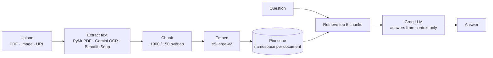

<div align="center">

# FilesGPT

**Chat with your documents.** Upload a PDF, a scanned image, or a web page — then ask questions and get answers grounded strictly in that content.


</div>

---

## What it does

FilesGPT is a full-stack RAG (Retrieval-Augmented Generation) application. You sign in, upload a source document, and chat with it. Answers come only from the document you uploaded — if the answer isn't there, the assistant says so instead of guessing.

- **PDFs** — uploaded directly or fetched from a URL
- **Scanned images & image-only PDFs** — OCR'd page by page via Gemini
- **Web pages** — scraped and cleaned to readable text
- **Conversational memory** — follow-up questions understand what came before
- **Saved chats** — revisit past conversations, delete them along with their vectors
- **Per-user isolation** — every document gets its own vector namespace

## How it works



Each document's vectors live in their own Pinecone namespace keyed `{user_id}-{document_id}`. That is what enforces user isolation and makes deletion a single clean operation.

Chat history is **stateless on the server**: `/chats/query` returns the updated history and the client sends it back on the next turn. Persisting a transcript is a separate, explicit action.

## Tech stack

| Layer | Technology |
| --- | --- |
| Frontend | React 19, Vite 7, Tailwind CSS 4, React Router 7, Framer Motion |
| Backend | FastAPI, Motor (async MongoDB), JWT auth (python-jose + passlib) |
| Database | MongoDB 7 |
| Vector store | Pinecone |
| Embeddings | `intfloat/e5-large-v2` — runs locally on CPU, 1024-dim |
| Chat model | Groq — `openai/gpt-oss-120b` |
| OCR | Google Gemini — `gemini-2.5-flash-lite` |
| Serving | nginx (static build + `/api` reverse proxy), Docker Compose |

## Quick start

### Prerequisites

- [Docker Desktop](https://www.docker.com/products/docker-desktop/)
- API keys (all have free tiers):
  - **[Groq](https://console.groq.com)** — chat model
  - **[Pinecone](https://app.pinecone.io)** — vector store
  - **[Google AI Studio](https://aistudio.google.com/apikey)** — Gemini OCR
  - *(optional)* **[Cloudinary](https://cloudinary.com)** — profile picture uploads

### 1. Create the Pinecone index

In the Pinecone console, create an index with:

| Setting | Value |
| --- | --- |
| Dimensions | **1024** |
| Metric | **cosine** |

> **Important:** the dimension must be 1024 to match the `e5-large-v2` embedding model. A mismatch makes every upload fail at ingest time, and Pinecone cannot change an index's dimension after creation.

### 2. Configure

```bash
cp .env.example .env
```

Fill in `JWT_SECRET`, `PINECONE_API_KEY`, `GROQ_API_KEY`, and `GOOGLE_API_KEY`, and set `PINECONE_INDEX` to the index you just created. Leave the Cloudinary keys blank to disable avatar uploads.

Generate a strong JWT secret:

```bash
python -c "import secrets; print(secrets.token_urlsafe(48))"
```

### 3. Run

```bash
docker compose up --build
```

Open **http://localhost:3000**.

> The first backend start downloads the embedding model (~1.3GB) into a Docker volume. This happens once — later starts are fast.

### Useful commands

```bash
docker compose logs -f backend
```

```bash
docker compose down
```

## Configuration

All settings are environment variables, read by `backend/app/config.py`. Everything except the API keys has a working default.

| Variable | Default | Description |
| --- | --- | --- |
| `JWT_SECRET` | — | **Required.** Signing key for access tokens |
| `JWT_EXPIRES_MINUTES` | `1440` | Token lifetime in minutes |
| `PINECONE_API_KEY` | — | **Required.** Pinecone credential |
| `PINECONE_INDEX` | `pdfgpt` | Index name — must be 1024-dim |
| `GROQ_API_KEY` | — | **Required.** Groq credential |
| `GROQ_MODEL` | `openai/gpt-oss-120b` | Chat model |
| `GOOGLE_API_KEY` | — | **Required** for image and scanned-PDF OCR |
| `GEMINI_OCR_MODEL` | `gemini-2.5-flash-lite` | OCR model |
| `EMBEDDING_MODEL` | `intfloat/e5-large-v2` | Changing this requires a matching index dimension |
| `MONGO_DB_NAME` | `filesgpt` | Database name |
| `CORS_ORIGINS` | `http://localhost:3000,http://localhost:5173` | Comma-separated allowed origins |
| `CHUNK_SIZE` / `CHUNK_OVERLAP` | `1000` / `150` | Text splitting |
| `RETRIEVAL_TOP_K` | `5` | Chunks retrieved per question |
| `CLOUDINARY_CLOUD_NAME` / `_API_KEY` / `_API_SECRET` | — | Optional, for avatar uploads |

## API

Interactive docs at **http://localhost:5000/docs**.

| Method | Endpoint | Description |
| --- | --- | --- |
| `POST` | `/auth/signup` | Register — multipart, optional `avatar` |
| `POST` | `/auth/login` | Obtain a JWT |
| `GET` `PUT` `DELETE` | `/auth/me` | Read, update, or delete the account |
| `POST` | `/documents/pdf` | Ingest a PDF — send `file` or `url` |
| `POST` | `/documents/image` | Ingest a scanned image or image-only PDF via OCR |
| `POST` | `/documents/website` | Ingest a web page — send `url` |
| `POST` | `/chats/query` | Ask a question about a document |
| `GET` | `/chats` | List saved chats |
| `POST` | `/chats` | Save a transcript |
| `GET` `DELETE` | `/chats/{id}` | Read or delete a saved chat |
| `GET` | `/health` | Liveness probe |

Everything except signup, login, and `/health` requires an `Authorization: Bearer <token>` header.

Deleting a chat also removes its source document and vectors. Deleting an account removes every document, chat, and vector belonging to that user.

## Project structure

```
.
├── backend/
│   ├── app/
│   │   ├── main.py          # app wiring: lifespan, CORS, error handler, routers
│   │   ├── config.py        # settings, read from the environment
│   │   ├── db.py            # Mongo connection + collection accessors
│   │   ├── schemas.py       # request/response models
│   │   ├── security.py      # password hashing, JWT, current-user dependency
│   │   ├── routers/
│   │   │   ├── auth.py      # /auth       signup, login, profile, deletion
│   │   │   ├── documents.py # /documents  pdf | image | website → shared ingest
│   │   │   └── chats.py     # /chats      query, save, list, read, delete
│   │   └── services/
│   │       ├── extract.py   # PDF / OCR / web-page text extraction
│   │       └── rag.py       # chunking, embedding, Pinecone, retrieval chain
│   ├── Dockerfile
│   └── requirements.txt
├── frontend/
│   ├── src/
│   │   ├── pages/           # Landing, Home, PDF, Image, Website, Chat, Profile
│   │   ├── components/      # Navbar, Login, Signup, ChatMessage, route guards
│   │   └── services/api.js  # single axios client — every backend call
│   ├── Dockerfile
│   └── nginx.conf           # serves the build, proxies /api → backend
└── docker-compose.yml
```

Uploads are processed **in memory** — nothing is written to disk.

## Local development

Run MongoDB on `localhost:27017`, then:

**Backend**

```bash
cd backend && python -m venv venv && venv\Scripts\activate
```

Install the CPU build of PyTorch first — the default PyPI wheel is the CUDA build and pulls roughly 7GB of NVIDIA libraries this project never uses:

```bash
pip install --index-url https://download.pytorch.org/whl/cpu torch
```

```bash
pip install -r requirements.txt && uvicorn app.main:app --reload --port 5000
```

On macOS or Linux, activate with `source venv/bin/activate`.

**Frontend**

Create `frontend/.env.local` containing `VITE_API_BASE_URL=http://127.0.0.1:5000`, then:

```bash
cd frontend && npm install && npm run dev
```


